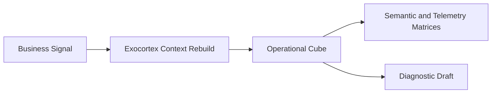

# Graph View Lite - Mermaid

```mermaid
flowchart LR
  USER[Business Signal]
  EXO[Exocortex Context Rebuild]
  CUBE[Operational Cube]
  TEL[Semantic and Telemetry Matrices]
  DIAG[Diagnostic Draft]
  USER --> EXO
  EXO --> CUBE
  CUBE --> TEL
  CUBE --> DIAG
```
